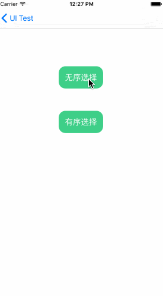

HTAssetsPicker
---
HTAssetsPicker 是一个灵活的资源选择器，支持图片、视频资源的选择。




特性
---

* 支持图片、视频资源选择
* 支持自定义 cell 样式与动画
* 支持自定义交互的响应方式（单击，双击，长按）
* 设置是否显示相机项，及其 cell 所在位置
* 自定义排版，设置 cell 的间隙和左右留白
* 设置最大可选择个数
* 提供简单的相册选择界面的实现

用法
---
不同项目对资源选择的视觉不尽相同，HTAssetsPicker对cell的基本行为和交互进行了抽象，提供了抽象类HTAssetsPickerCell，使用者需要派生出自定义cell，通过实现或覆写一些必要的方法来定制视觉表现和交互行为。

####这里给出一个自定义cell的简单示例：

```
@interface MyCell : HTAssetsPickerCell
@end

@interface MyCell ()
//本例中，当点击选中cell，用于表示选中状态的外框视图
@property (nonatomic,strong) UIImageView* overlapView;
@end

@implementation MyCell

...//其他代码

- (instancetype)initWithFrame:(CGRect)frame{
    self = [super initWithFrame:frame];
    if (self) {
        ...//其他代码
        _overlapView = [[UIImageView alloc]init];
        _overlapView.hidden = YES;
        _overlapView.image = [UIImage imageNamed:@"overlap_image"];
        [self addSubview:_overlapView];
        ...//其他代码
    }
    return self;
}

//cell被选中，显示overlapView
- (void)selectedWithIndex:(NSInteger)index{
    _overlapView.hidden = NO;    
}

//cell取消选中，隐藏overlapView
- (void)deselected{
    _overlapView.hidden = YES;
}

//重置cell状态
- (void)reset{
    [super reset];
    _overlapView.hidden = YES;
}

//cell响应交互
- (void)onInteracted:(HTAssetPickerCellInteactType)interactType{
	//只响应单击事件
	if(interactType != HTAssetPickerCellInteactTypeSingleTapped){
		return;
	}
	//选择
    if (!self.assetItem.selected) {
        [self trySelect];
    }else{//取消选择
        [self tryDeselect];
    }
}

...//其他代码

@end
```

####HTAssetsPicker的使用示例：

```
//根据自定义cell创建资源选择视图
HTAssetsPickerView* assetsPicker = [[HTAssetsPickerView alloc]initWithCellClass:MyCell.class];

//设置代理
assetsPicker.assetsPickerDelegate = self;

//设置选择资源类型为图片
assetsPicker.assetsType = HTAssetsTypePhoto;

//通过间距来设置cell的布局，排版会计算出每个cell的尺寸，也可直接通过itemSize属性来设置cell尺寸
assetsPicker.interitemSpacing = 4;
assetsPicker.lineSpacing = 8;
assetsPicker.inset = UIEdgeInsetsMake(4, 2, 0, 2);
assetsPicker.itemsCountEachRow = 4;

//设置相机所在位置和图片名称
assetsPicker.cameraItemIndex = 0;
assetsPicker.cameraImageName = @"HTAssetsPickerCamera";

//设置最大选择数
assetsPicker.maxSelectedCount = 9;

//为assets picker设置model(相册)，此示例设置为系统默认相册
//注意：此处代码参考下面设置相册信息说明


//添加图片选择视图
[self.view addSubview:assetsPicker];
```


####设置相册信息说明

（**重要说明**）HTAssetsPicker实现上：

* iOS7及以前，使用AssetsLibrary.framework
* iOS8及以后，使用Photos.framework，即使用户上层使用AssetsLibrary获取相册，并把相册信息设置给HTAssetsPickerView，内部也会使用Photos.framework转换成相对应的资源，做到接口的兼容。例如下面的示例代码：


```
//iOS8+,使用Photos.framework获取相册信息
if (HTASSETSPICKER_USE_PHOTOKIT) {
    PHFetchResult *smartAlbums = [PHAssetCollection
                                    fetchAssetCollectionsWithType:PHAssetCollectionTypeSmartAlbum
                                                            subtype:PHAssetCollectionSubtypeSmartAlbumUserLibrary options:nil];
    if (smartAlbums.count == 1) {
        PHCollection *collection = smartAlbums[0];
        if ([collection isKindOfClass:[PHAssetCollection class]]) {
            PHAssetCollection *assetCollection = (PHAssetCollection *)collection;
            [_imagePicker.assetsPicker setAssetCollection:assetCollection];
            
        } else {
            NSAssert(NO, @"Fetch collection not PHCollection: %@", collection);
        }
    }
}else{
//iOS7-,使用AssetsLibrary.framework
    [_library enumerateGroupsWithTypes:ALAssetsGroupSavedPhotos usingBlock:^(ALAssetsGroup *group, BOOL *stop) {
        if (group) {
            [assetsPicker setAssetGroup:group];
        }
        *stop = YES;
    } failureBlock:^(NSError *error) {
        NSLog(@"enumerateGroupsWithTypes failed:%@",error);
    }];
    
}

```

对于上面代码，为了简单起见，且为了兼容iOS7，HTAssetsPicker的使用者完全可以只写else中的逻辑，这里利用**[assetsPicker setAssetGroup:group];**设置相册信息，如果是iOS7及以前，HTAssetsPicker则直接使用该AssetGroup获取相片列表，如果是iOS8及以后，HTAssetsPicker内部会利用Photos.framework找到相应的相册，相片列表的获取最终会使用Photos.framework的相关API来完成。


安装
---
###	CocoaPods

1. `pod 'HTAssetsPicker'`
2. `pod install`或`pod update`
3. \#import "HTAssetsPickerView.h"
	
系统要求
---

该项目最低支持`iOS 7.0`和`Xcode 7.0`

许可证
---

HTAssetsPicker使用MIT许可证，详情见LICENSE文件。